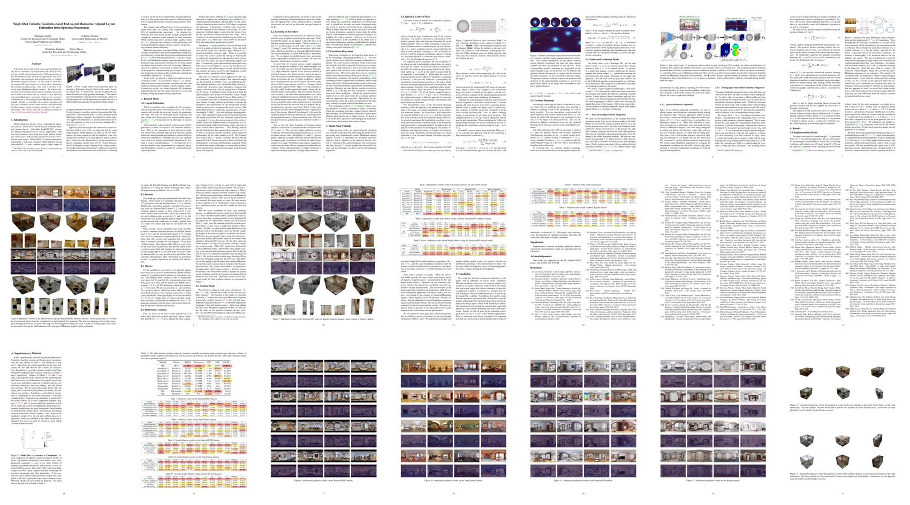

# Single-Shot Cuboids: Geodesics-based End-to-end Manhattan Aligned Layout Estimation from Spherical Panoramas

[](https://arxiv.org/pdf/2102.03939.pdf)
[](https://vcl3d.github.io/SingleShotCuboids/)
[](https://doi.org/10.1016/j.imavis.2021.104160)
[](https://ars.els-cdn.com/content/image/1-s2.0-S0262885621000652-mmc1.pdf)


This repository contains the code and models for the paper _"Single-Shot Cuboids: Geodesics-based End-to-end Manhattan Aligned Layout Estimation from Spherical Panoramas"_.

> Parts of the code can be used for keypoint localisation using spherical panorama inputs (projected in the equirectangular domain).

## Usage

### Inference

To use the [pretrained model](#Download) and receive its predictions on panorama images run:

```py
                        python inference.py 'GLOB_PATH'
```
where `GLOB_PATH` can be a single filename (`image.jpg`), or a folder search pattern (`path/to/images/*.jpg`).

Additional options are:

- `--model MODEL`: Use a different model, available choices include:
  - `ssc`: The real-world data trained Single-Shot Cuboids model. (this is the *default* mode)
  - `ssc_syn`: The synthetic data trained Single-Shot Cuboids model.
  - `hnet`: The real-world data trained HorizonNet model.
  - `hnet_syn`: The synthetic data trained HorizonNet model.
- `--output_path PATH_TO_SAVE_RESULTS`: An existing folder where the predictions will be saved at. (*default*: `'.'`)
- `--gpu INTEGER_ID`: Select a different GPU to run inference on.(*default*: `0`)
- `--floor_distance NEGATIVE_FLOAT_VALUE`: Used when saving the resulting meshes and during cuboid fitting. (*default*: `-1.6m`)
- `--remove_ceiling`: Using this flag will remove the ceiling from the resulting meshes.
- `--save_boundary`: Using this flag will save a visualization of the layout wireframe on the panorama.
- `--save_mesh`: Using this flag will save a textured mesh of the result.
- `--mesh_type`: A choice for the mesh output. Can be either `obj` or `usdz` for Wavefront and Pixar's formats respectively.

### Serve

It is also possible to use the models via [torchserve](https://pytorch.org/serve/).

The `scripts/torchserve_create_*.bat` shell scripts create the `.mar` files found in `/mars` ([pre-archived](#Download) ones are also available).

These can be used to serve these models using REST calls by executing the `scripts/torchserve_run_*.bat` shell scripts. Upon serving them the endpoints are reachable at `http://IP:8080/predictions/MODEL_NAME`, with `IP` as selected when configuring torchserve (typically `localhost`, but more [advanced configuration](https://pytorch.org/serve/configuration.html) is also possible to serve models externally or make them reachable from other machines, using the `inference_address` setting). The `MODEL_NAME` is the same as the `--model MODEL_NAME` flag mentioned [above](#Inference).

A callback URL based json payload needs to be POSTed to retrieve predictions:
```json
"inputs": {
  "color": "GET_IMAGE_URL"
},
"outputs": {
  "boundary": "POST_BOUNDARY_URL",
  "mesh": "POST_MESH_URL"
},
"floor_distance": NEGATIVE_FLOAT_VALUE,
"remove_ceiling": BOOLEAN_VALUE,
```

Apart from the latter two options which are optional and take the default values mentioned [above](#Inference), the `GET/POST` callback URLs are serving inference images (`GET`), or saving predicted results (`POST`).

An image and results server is provided and started via:

```py
                        python panorama_server.py 'GLOB_PATH'
```

which hosts all images given in `GLOB_PATH` at `http://IP:PORT/FILENAME`. It also offers an exporting endpoint at `http://IP:PORT/save/FILENAME` which saves the corresponding output files.

Other arguments apart from the input panorama glob path are:

- `--output_path PATH_TO_SAVE_RESULTS`: An existing folder where the predictions will be saved at. (*default*: `'.'`)
- `--ip ADDRESS_STRING`: The IP address where the endpoint will be reachable at. (*default*: `localhost`)
- `--port PORT_NUMBER`: The port number where the endpoint will be reachable at. (*default*: `5000`)

Once the models are served and the panorama server is running, at the `INFERENCE_SERVER_ENDPOINT` and `IMAGE_SERVER_ENDPOINT` respectively, a prediction is callable via:

```bash
curl -H "Content-Type: application/json" -d "{\"inputs\": {\"color\":
\"http://IMAGE_SERVER_ENDPOINT/image.jpg\"}, \"outputs\": {\"boundary\": \"http://IMAGE_SERVER_ENDPOINT/save/boundary_image.jpg\", \"mesh\":
\"http://IMAGE_SERVER_ENDPOINT/save/mesh.obj\"}}"
http://INFERENCE_SERVER_ENDPOINT/predictions/ssc
```

The outputs arguments are optional and can be omitted if no result saving is required. The response will include in json format a list of lists denoting the layout corner pixel positions in interleaving `top/bottom/top/bottom/etc.` order. 

Assuming that the model and panorama server are hosted locally with their default ports and the input image is `img.png` then the REST command for the `ssc` model is:

```bash
curl -H "Content-Type: application/json" -d "{\"inputs\": {\"color\":
\"http://localhost:5000/img.png\"}, \"outputs\": {\"boundary\":
\"http://localhost:5000/save/img.jpg\", \"mesh\":
\"http://localhost:5000/save/img.obj\"}}"
http://localhost:8080/predictions/ssc
```

### Download

The `./ckpt` and `./mar` folders should contain the torch checkpoint saved files for all models, as well as the torch archives for serving them.
To download them either run the `download.bat` scripts at the respective folders, or check the README instructions to download them manually from the respective releases.


## Modules

Plug-n-play modules of the different components are also available and ready to be integrated.

### Geodesic Distace
The [`GeodesicDistance`](https://github.com/VCL3D/SingleShotCuboids/blob/584aec312fb381b0a02acd89dd2e299f3fdc7ec5/ssc/geodesic_distance.py#L24) module found in [`./ssc/geodesic_distance.py`](https://github.com/VCL3D/SingleShotCuboids/blob/master/ssc/geodesic_distance.py) calculates the great circle or harvesine distance of two coordinates on the sphere. The following image shows the harvesine distance and the corresponding great circle path between points on the equirectangular domain. Distances from the red square to the colored diamonds are also reported in the corresponding color.

```py
                            loss = GeodesicDistance()
```

<p align="center">
  
</p>

An interactive comparison between the geodesic distance and the L2 distance can be run with:

```bash
                        python ssc/geodesic_distance.py
```

Left clicking selects the first (left hand side) point, and right clicking the corresponding second (right hand side) point.
Upon having selected a left and right point, their geodesic and L2 distance will be printed.

### Geodesic Heatmaps
The [`GeodesicGaussian`](https://github.com/VCL3D/SingleShotCuboids/blob/584aec312fb381b0a02acd89dd2e299f3fdc7ec5/ssc/geodesic_gaussian.py#L41) module found in [`./ssc/geodesic_gaussian.py`](https://github.com/VCL3D/SingleShotCuboids/blob/master/ssc/geodesic_gaussian.py) relies on the geodesic distance and reconstructs a Gaussian distribution directly on the equirectangular domain that respects the continuity around the horizontal boundary, and, at the same time, is aware of the equirectangular projection's distortion.

```py
                  module = GeodesicGaussian(std=9.0, normalize=True)
```

The following images show a Gaussian distribution defined on the sphere (left) and the corresponding distribution reconstructed on the equirectangular domain (right).


Different (20) random centroid distributions can be visualized by runningwith:

```bash
                python ssc/geodesic_gaussian.py {std: float=9.0} {width: int=512}
```

with the (optional) std argument given in degrees (default: `9.0`), and the (optional) width argument defining the equirectangular pixels at the longitudinal angular coordinate (default: `512`).

### Quasi-Manhattan Center of Mass
The [`QuasiManhattanCenterOfMass`](https://github.com/VCL3D/SingleShotCuboids/blob/584aec312fb381b0a02acd89dd2e299f3fdc7ec5/ssc/quasi_manhattan_center_of_mass.py#L6) module found in [`./ssc/quasi_manhattan_center_of_mass.py`](https://github.com/VCL3D/SingleShotCuboids/blob/master/ssc/quasi_manhattan_center_of_mass.py) estimates the meridian-aligned top and bottom corners using either:
- the `standard` mode that calculates the default center of mass (CoM), or,
- the `periodic` mode which calculates a boundary aware spherical center of mass.

```py
                module = QuasiManhattanCenterOfMass(mode='periodic')
```

Their differences are depicted in the following figure, where the CoM of a set of _blue_ or _pink_ particles, whoses masses are denoted by their size, is estimated with both methods on an equirectangular grid.
The `standard` method (_white filled particles_) fails to properly localize the CoM as it neglects the image's continuity around the horizontal boundary.
The `periodic` method (_darker filled colored particles_) resolves this issue taking into account the continuous boundary.

<p align="center">

</p>

The input to the module's `forward` function is:

- a `[W x H]` grid `G` with coordinates normalized to `[-1, 1]`, and,
- the predicted heatmap `H`.

```py
                       corners = scom.forward(grid, gaussian)
```

An example with randomly allocated points, their geodesic gaussian reconstruction and the corresponding localisations using a normalized grid can be seen by running:

```bash
    python ssc/quasi_manhattan_center_of_mass.py '{mode: standard|periodic}'
```

### Cuboid Fitting
The [`CuboidFitting`](https://github.com/VCL3D/SingleShotCuboids/blob/584aec312fb381b0a02acd89dd2e299f3fdc7ec5/ssc/cuboid_fitting.py#L6) module found in [`./ssc/cuboid_fitting.py`](https://github.com/VCL3D/SingleShotCuboids/blob/master/ssc/cuboid_fitting.py) fits a cuboid into `8` estimated corner locations as described in the paper and depicted in the following figure.

```py
                      head = CuboidFitting(mode='joint')
```


A set of examples can be run using:

```bash
      python ssc/cuboid_fitting.py '{test: [1-7]]} {mode: floor|ceil|avg|joint}'
```

where one of `7` test cases can be selected and one of the available modes:

- `floor` for using the floor as a fixed height plane, 
- `ceil`  for using the ceiling as a fixed height plane,
- `avg` for using both and averaging their projected coordinates, and,
- `joint` for fusing the floor view projected floor and ceiling coordinates.

The original coordinates will be colored blue, while the cuboid fitted coordinates will be colored green.

Examples on the different test sets follow, with the images on the left being the predicted coordinates floor plan view, and the images on the right those after cuboid fitting:

#### Sun360


<!--


-->

#### Stanford2D3D

<!--


-->


#### Structured3D


<!--


-->

#### Kujiale


<!--


-->

### Spherically Padded Convolution

The [`SphericalConv2d`](https://github.com/VCL3D/SingleShotCuboids/blob/584aec312fb381b0a02acd89dd2e299f3fdc7ec5/ssc/spherically_padded_conv.py#L44) module in [`./ssc/spherically_padded_conv.py`](https://github.com/VCL3D/SingleShotCuboids/blob/master/ssc/spherically_padded_conv.py) applies the padding depicted below that adapts traditional convs to the equirectangular domain by replication padding at the singularities/poles and circular padding around the horizontal boundary.

<p align="center">

</p>

## Citation

<p align="center">
<a href="https://arxiv.org/pdf/2102.03939.pdf" alt="paper link">
 
</a>
</p>

If you used or found this code and/or models useful, please cite the following:

```bibtex
@article{zioulis2021singleshot,
title = {Single-shot cuboids: Geodesics-based end-to-end Manhattan aligned layout estimation from spherical panoramas},
author = {Nikolaos Zioulis and Federico Alvarez and Dimitrios Zarpalas and Petros Daras},
journal = {Image and Vision Computing},
volume = {110},
pages = {104160},
year = {2021},
issn = {0262-8856},
doi = {https://doi.org/10.1016/j.imavis.2021.104160},
url = {https://github.com/VCL3D/SingleShotCuboids},
keywords = {Panoramic scene understanding, Indoor 3D reconstruction, Layout estimation, Spherical panoramas, Omnidirectional vision}
}
```

## Acknowledgements
<p align="center">

</p>

This project has received funding from the European Union’s Horizon 2020 research and innovation programme [__ATLANTIS__](http://atlantis-ar.eu/) under grant agreement No 951900.

Parts of the code used in this work have been borrowed or adapted from these repositories:

- [Structured3D](https://github.com/bertjiazheng/Structured3D) from [Jia Zheng](https://github.com/bertjiazheng)
- [Anti-aliased CNNs](https://github.com/adobe/antialiased-cnns) from [Richard Zhang](https://github.com/richzhang)
- [HorizonNet](https://github.com/sunset1995/HorizonNet) from [Cheng Sun](https://github.com/sunset1995)
- [Stacked Hourglass](https://github.com/princeton-vl/pytorch_stacked_hourglass) from [Chris Rockwell](https://github.com/crockwell)
- [Svd Gist](https://gist.github.com/mkocabas/54ea2ff3b03260e3fedf8ad22536f427) from [Muhammed Kocabas](https://github.com/mkocabas)
- The `panorama_server.py` is based on a template image server created by [Werner Bailer](https://github.com/wbailer)
  