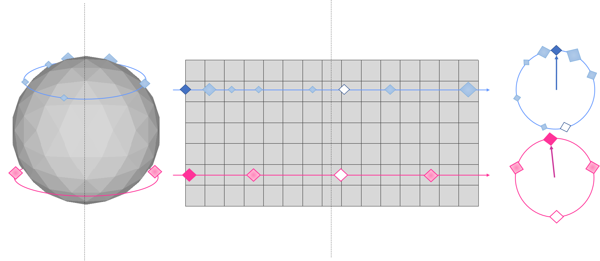

# Single-Shot Cuboids: Geodesics-based End-to-end Manhattan Aligned Layout Estimation from Spherical Panoramas

[](https://arxiv.org/pdf/)
[](https://vcl3d.github.io/SingleShotCuboids/)

## Code

## Geodesic Distace
The `GeodesicDistance` module found in `./ssc/geodesic_distance.py` calculates the great circle or harvesine distance of two coordinates on the sphere.

An interactive comparison between the geodesic distance and the L2 distance can be run with:

```bash
    python ssc/geodesic_distance.py
```

Left clicking selects the first (left hand side) point, and right clicking the corresponding second (right hand side) point.
Upon having selected a left and right point, their geodesic and L2 distance will be printed.

## Geodesic Heatmaps


## Quasi-Manhattan Center of Mass
The `QuasiManhattanCenterOfMass` module found in `./ssc/quasi_manhattan_center_of_mass.py` estimates the meridian-aligned top and bottom corners using either:
- the `standard` mode that calculates the default center of mass (CoM), or,
- the `periodic` mode which calculates a boundary aware spherical center of mass.

```py
                module = QuasiManhattanCenterOfMass(mode='periodic')
```

Their differences are depicted in the following figure, where the CoM of a set of _blue_ or _pink_ particles, whoses masses are denoted by their size, is estimated with both methods on an equirectangular grid.
The `standard` method (_white filled particles_) fails to properly localize the CoM as it neglects the image's continuity around the horizontal boundary.
The `periodic` method (_darker filled colored particles_) resolves this issue taking into account the continuous boundary.



The input to the module's `forward` function is:

- a `[W x H]` grid `G` with coordinates normalized to `[-1, 1]`, and,
- the predicted heatmap `H`.

```py
                       corners = scom.forward(grid, gaussian)
```

An example with randomly allocated points, their geodesic gaussian reconstruction and the corresponding localisations using a normalized grid can be seen by running:

```bash
    python ssc/quasi_manhattan_center_of_mass.py '{mode: standard|periodic}'
```

## Citation
If you use this code and/or data, please cite the following:
```
@arcticle{zioulis2021singleshot,
  author       = "Zioulis, Nikolaos and Alvarez, Federico and Zarpalas, Dimitris and Daras, Petros",
  title        = "Single-Shot Cuboids: Geodesics-based End-to-end Manhattan Aligned Layout Estimation from Spherical Panoramas",
  archivePrefix = {arXiv},  
  month        = "February",
  year         = "2021"
}