# Abstract

> It has been shown that global scene understanding tasks like layout estimation can benefit from wider field of views, and specifically spherical panoramas. While much progress has been made recently, all previous approaches rely on intermediate representations and postprocessing to produce Manhattan-aligned estimates. In this work we show how to estimate full room layouts in a single-shot, eliminating the need for postprocessing. Our work is the first to directly infer Manhattan-aligned outputs. To achieve this, our data-driven model exploits direct coordinate regression and is supervised end-to-end. As a result, we can explicitly add quasi-Manhattan constraints, which set the necessary conditions for a homography-based Manhattan alignment module. Finally, we introduce the geodesic heatmaps and loss and a boundary-aware center of mass calculation that facilitate higher quality keypoint estimation in the spherical domain.
Our models and code are publicly available at [https://github.com/VCL3D/SingleShotCuboids](https://github.com/VCL3D/SingleShotCuboids).

# Highlights

- **Single-shot**, end-to-end, spherical panorama-based cuboid layout corner estimation.

- **Spherical Center of Mass** for boundary-aware keypoint estimation on the sphere.

- **Explicit layout constraints** via direct keypoint estimation.

- **Geodesic Distance Loss** for boundary-aware keypoint estimation on the sphere.

-  **Geodesic Gaussian Heatmap Reconstruction** for spherical center of mass keypoints:

- **Homography-based Cuboid Fitting** that ensures end-to-end full Manhattan alignment.

# Results

## Sun360

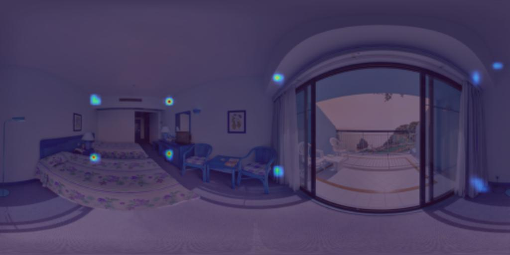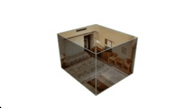

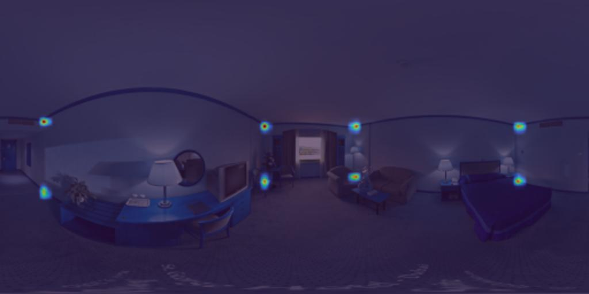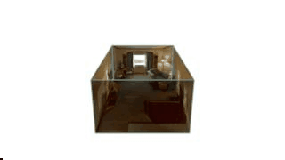

## Stanford2D3D

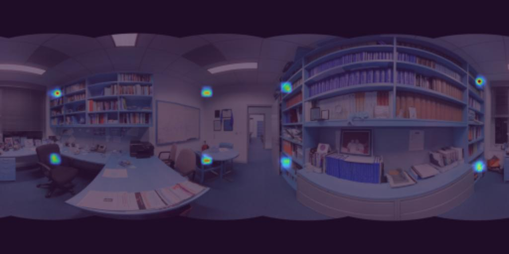
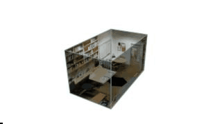

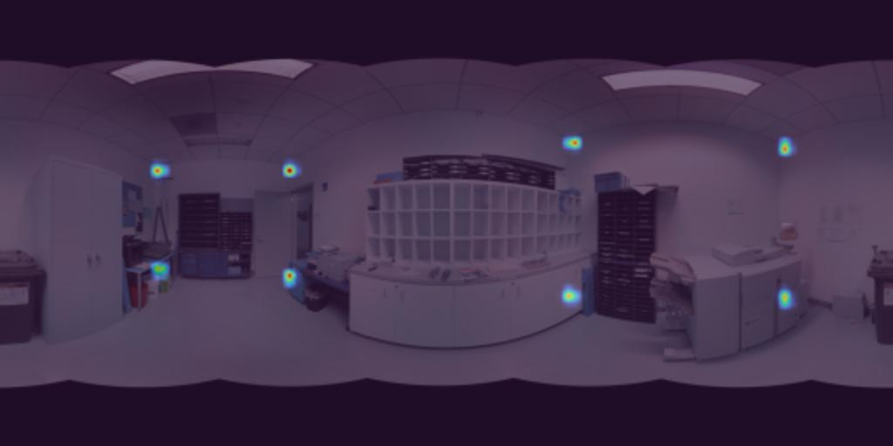
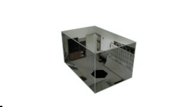

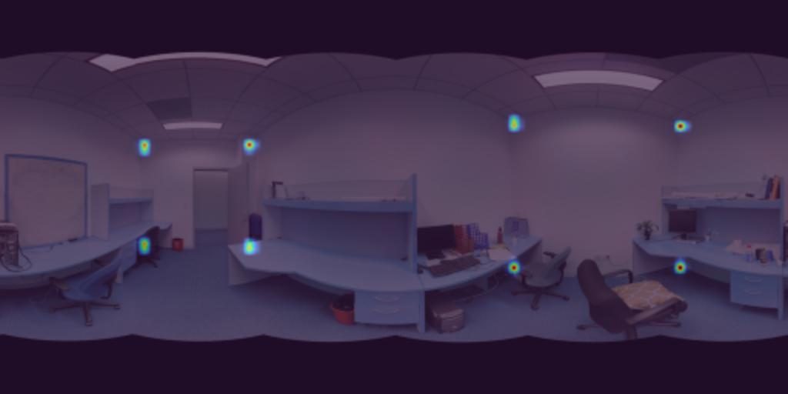
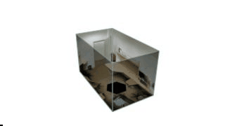

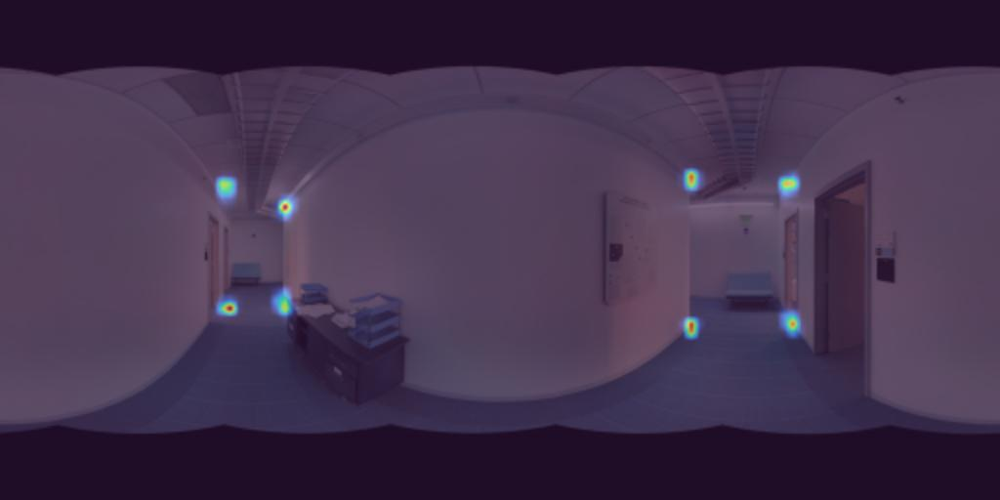
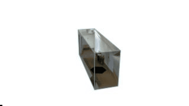

## Structure3D

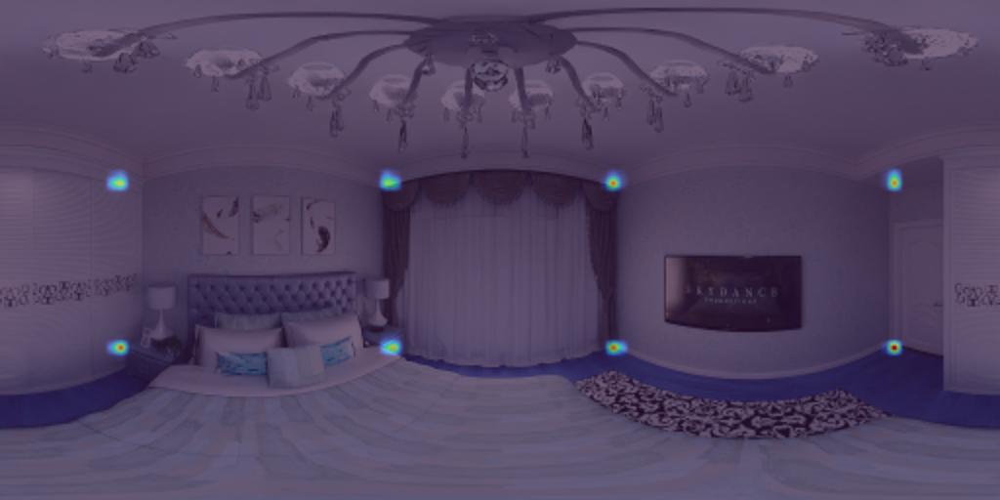
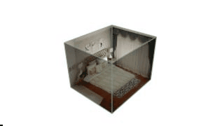

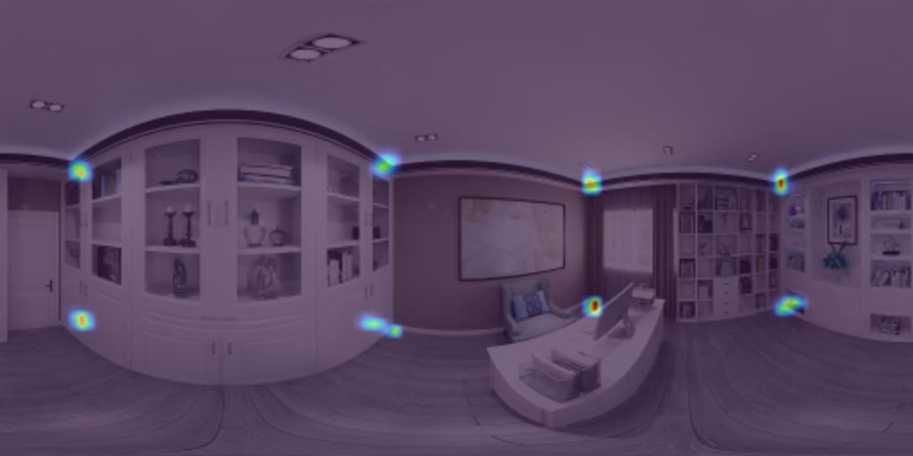
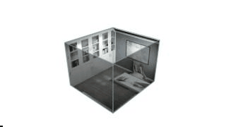

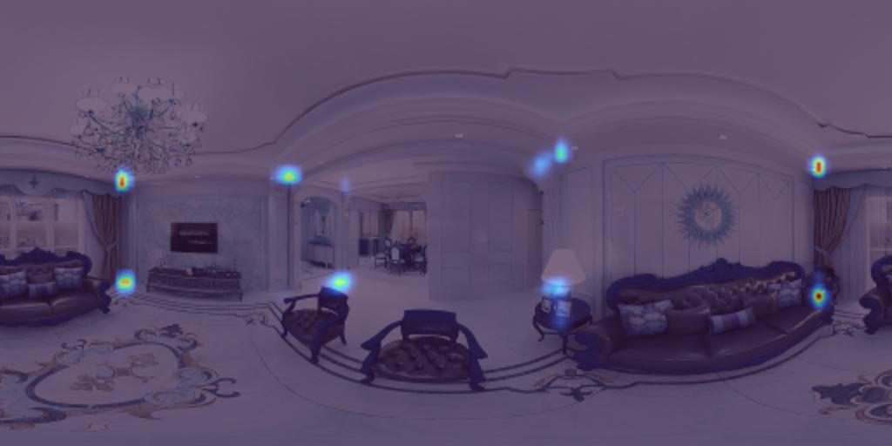
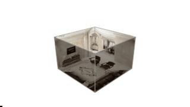

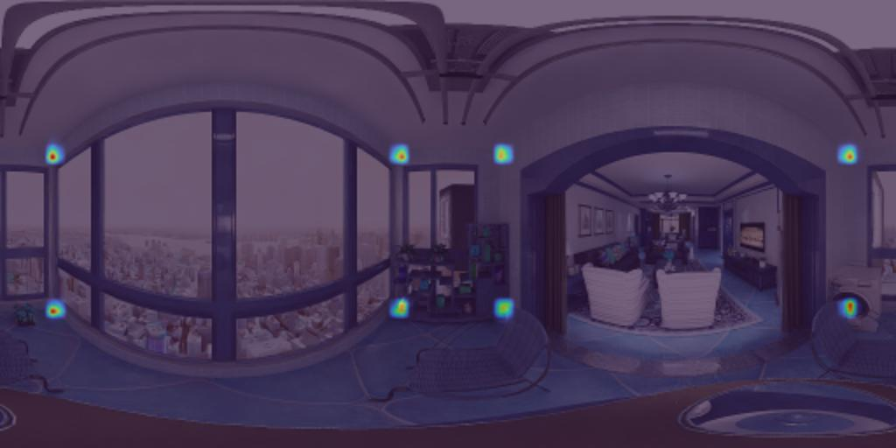
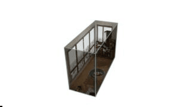

## Kujiale

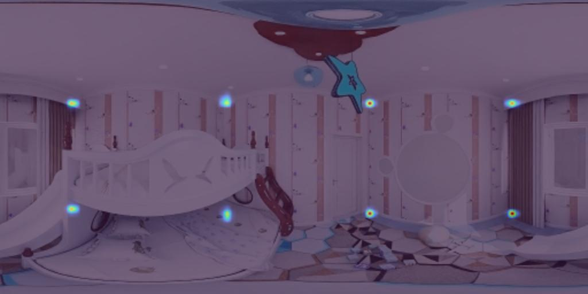
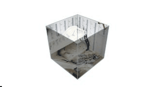

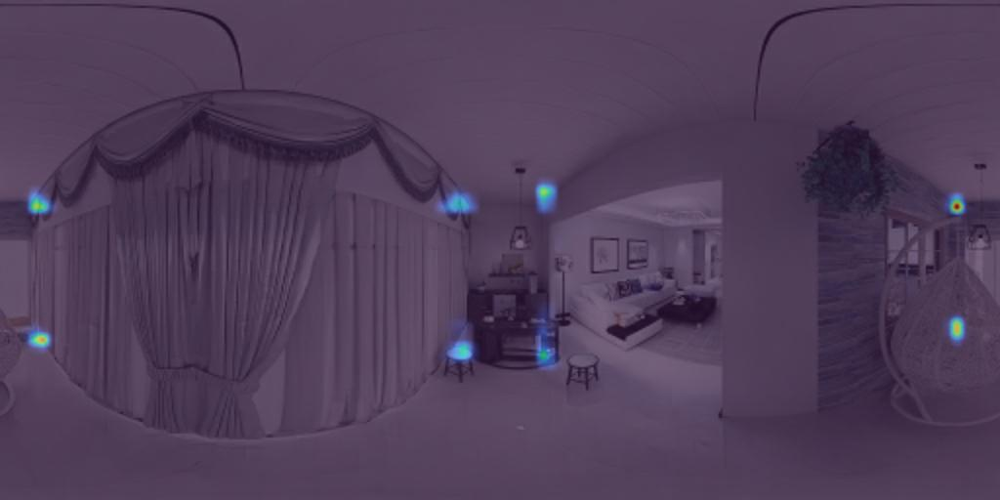
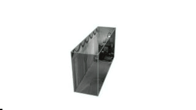

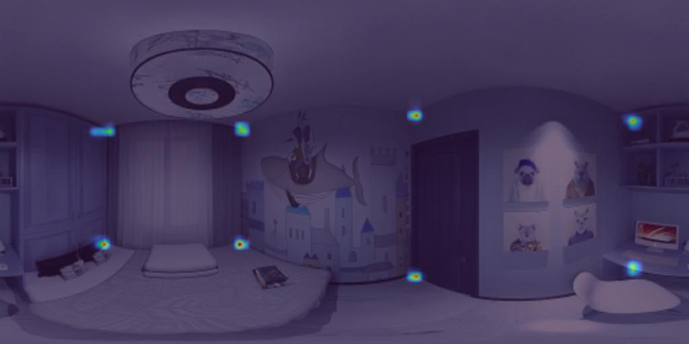
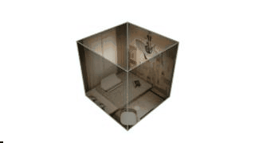

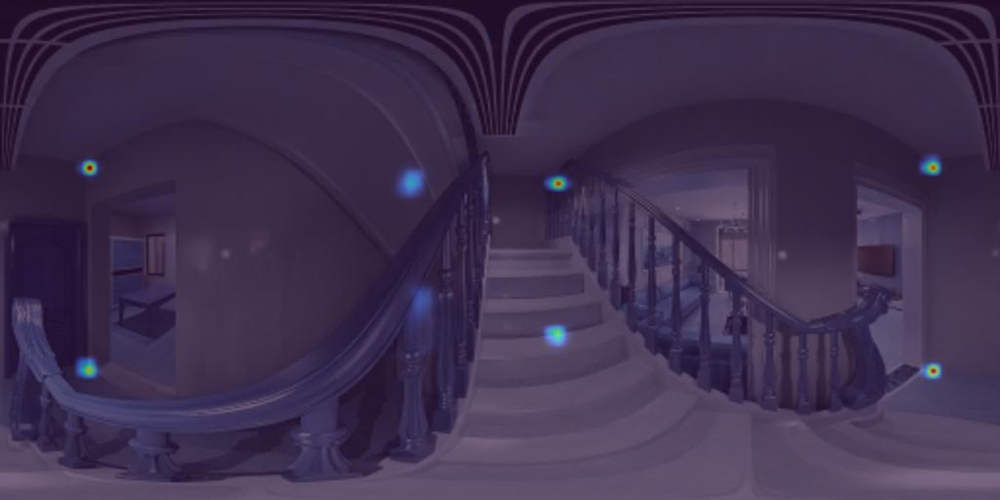
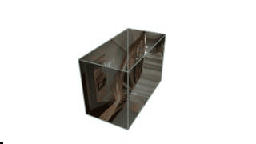
